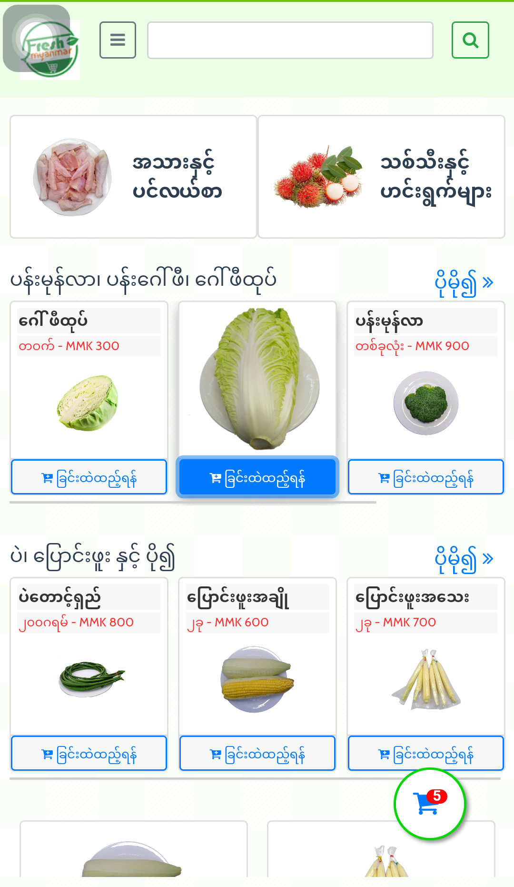
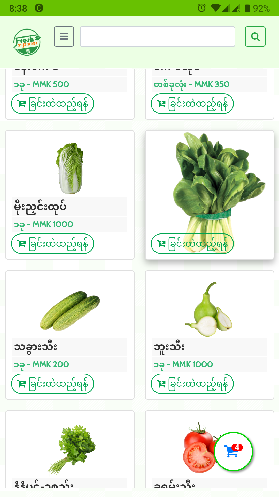
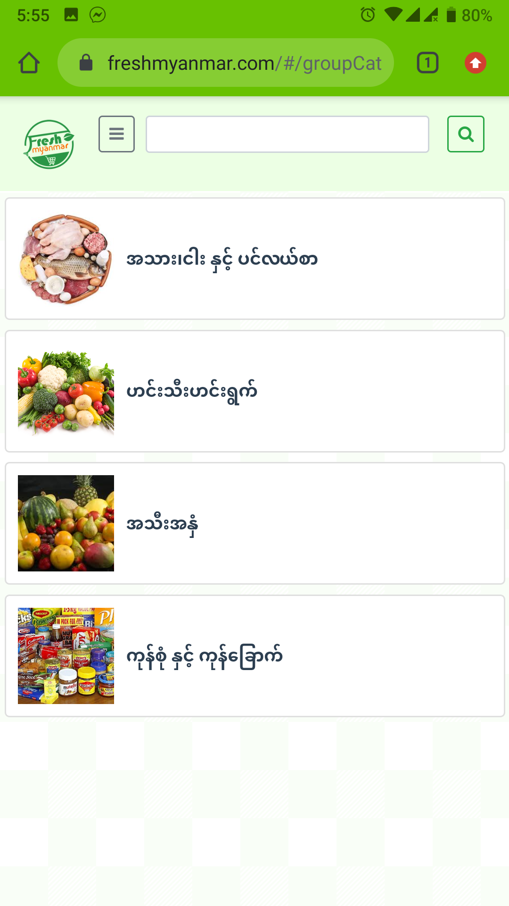

# greenshop_java

This project is spring boot java project and to order fresh food from Mobile App (Hybrid).

In this project uses spring boot, jpa and thymeleaf template and report for Jasper Report. This project develop admin panel for MVC pattern (thymeleaf) template and PWA for app user to get data from REST api.

Notification system use firebase notification. 

Support Multiple language 
English
Myanmar

ScreenShot1

ScreenShot2

ScreenShot3

